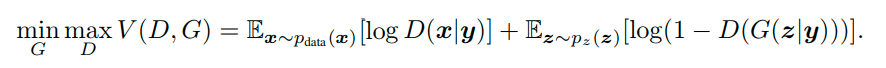
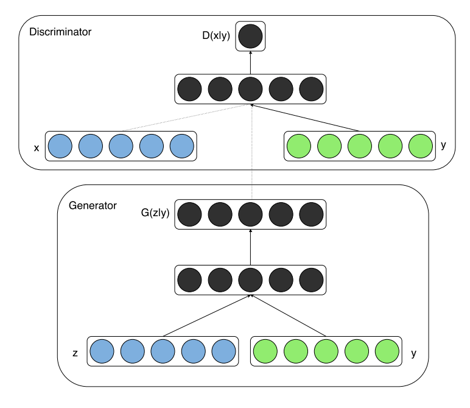

URL: https://arxiv.org/pdf/1411.1784.pdf

## Main idea
Perform the conditioning by feeding  into both generator and discriminator as additional input layer.

The objective function of Conditional GAN is:

The following illustration shows the basic structure of a simple conditional adversarial net.

