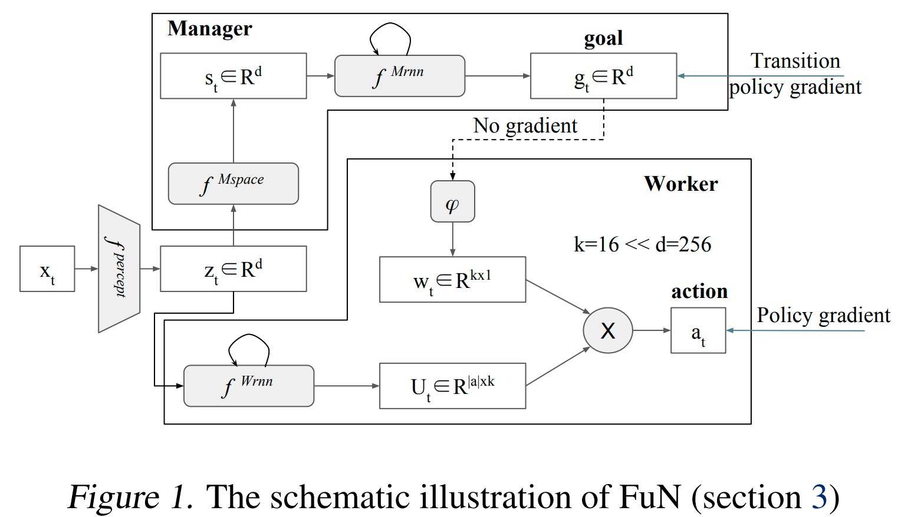
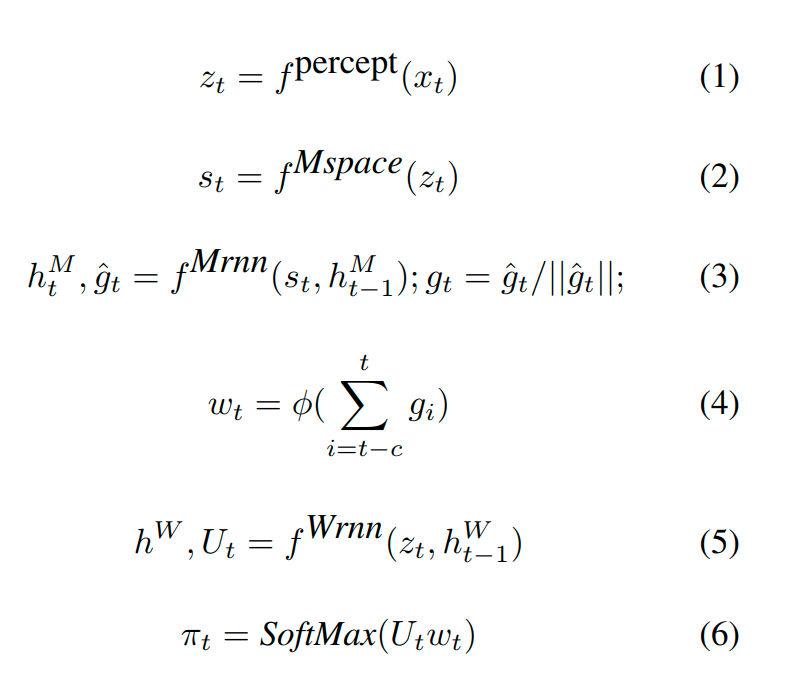

URL: https://arxiv.org/pdf/1703.01161.pdf

## Objectiveness
Outperform a strong baseline agent on task that involve long-term credit assignment or memorisation

## Points
+ The Manager module should be trained using the gradients from the Worker module, since this would deprive Manager's goals  of any semantic meaning, making them just internal latent variables of the model. FuN trains the Manager module by transition policy gradients.
+ The goals are directional rather than absolute values

## Main idea
Decouple end-to-end learning across multiple levels, allowing it to utilise different resolutions of time. FuN is composed of Manager module which computes a latent state representation  and outputs a goal vector  and Worker module which also takes  as its input and produces an embedding vector for actions . The latent state representation  is computed by a perceptual module given current state. The last  goal vector  calculated from the Manager module is required to be fed into a linear transform , which, denoted as https://latex.codecogs.com/svg.latex?\w_t), is further combined with the embedding vector for actions https://latex.codecogs.com/svg.latex?U_t) via matrix-vector product. The final output is the policy https://latex.codecogs.com/svg.latex?\pi), vector of probabilities over primitive actions.

### Train
+ The Manager module is trained by transition policy gradient
+ The Worker module is trained by policy gradient

## Model

## Formulas

