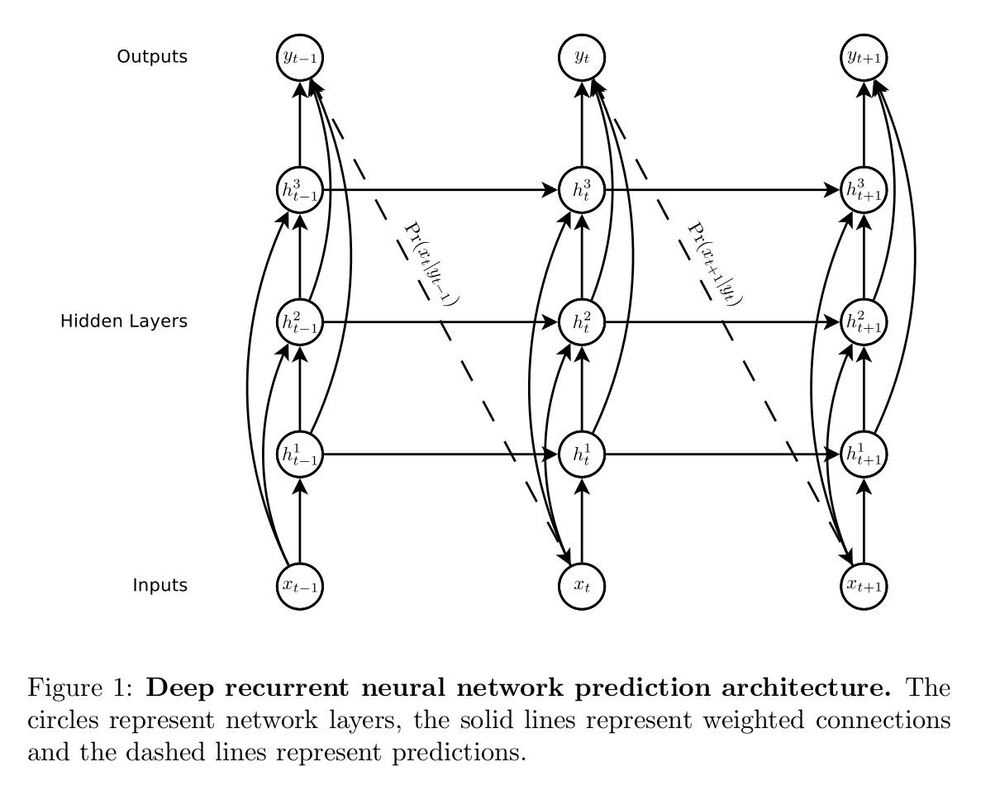
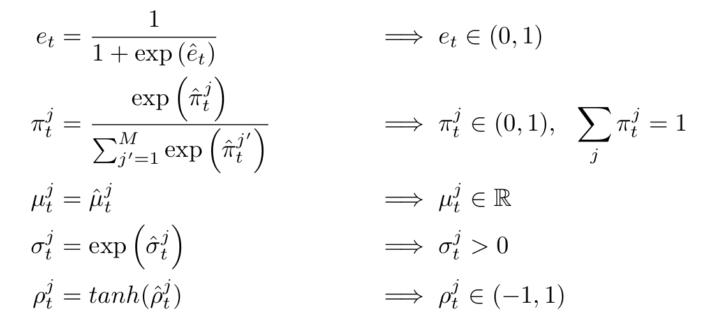
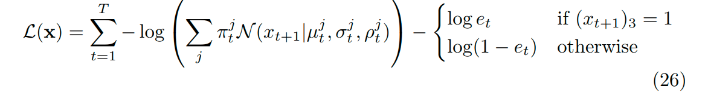
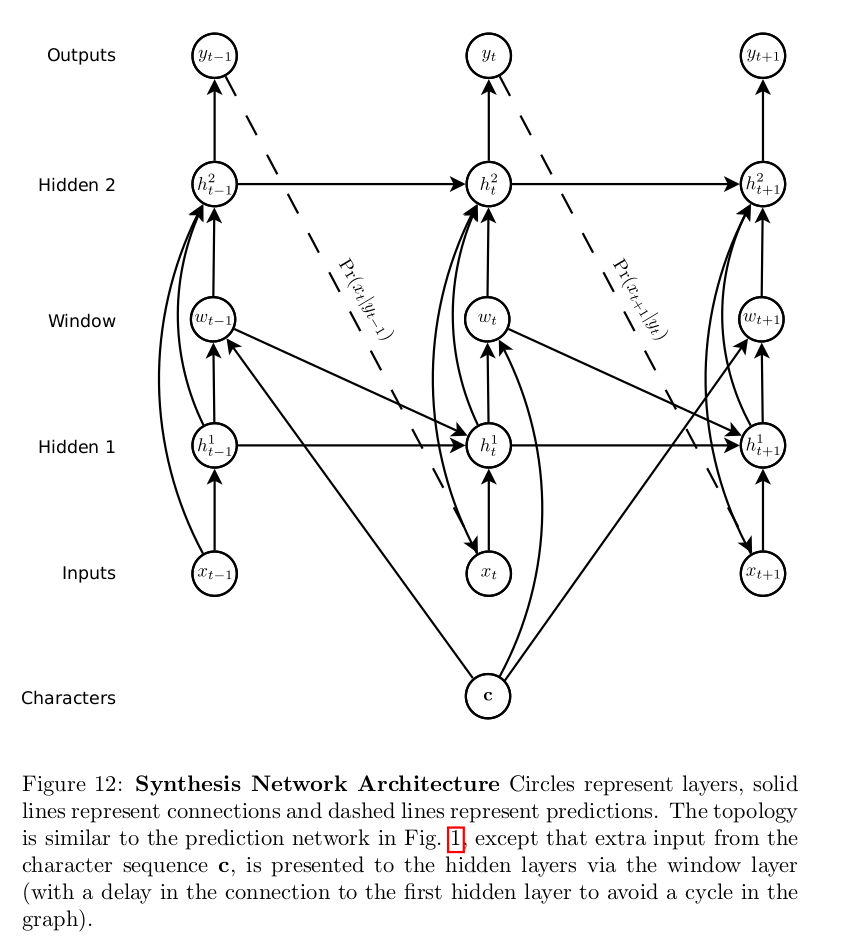
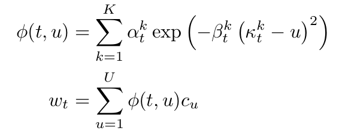
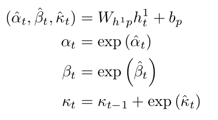

# Generating Sequences With Recurrent Neural Networks

## Objectiveness

Demonstrate that LSTM can be used for complex sequences generation by predicting online handwriting.

## 

## 1. Handwriting Prediction

The idea of **mixture density outputs** is to use the outputs of neural network to parameterise a mixture distribution. A subset of the outputs are used to define the mixture weights, while the remaining outputs are used to parameterise the individual mixture component.

Each input vector `x` consists of **a real-valued pair `(x_1, x_2)`** to represent the pen offset from the previous point, along with **a binary `s`** that has value 1 if the vector ends the stroke and value 0 otherwise. In our case, a mixture of bivariate Gaussians is used to predict `(x_1, x_2)`, while a Bernoulli distribution was used for `s`. Therefore, each output vector `y` consists of the end of stroke probability `e`, along with a set of means `μ`, standard deviations `σ`, correlations `ρ` and mixture weights `π` for the `M` mixture components, in which case `y` contains `1 + M*6` elements. 

Since each distribution probability has certain requirements on its parameters, it is necessary to **preprocess the outputs** of LSTM so that the predicted parameters meet the requirements. The preprocessing formulas are listed below:

The meaning of the parameters:

+ : parameter of the Bernoulli distribution
+ : weight of the i-th bivariate normal distribution
+  and : means of the i-th bivariate normal distribution
+  and : standard deviations of the i-th bivariate normal distribution
+ : correlation of the i-th bivariate normal distribution

### Sampling

+ weighted sum of `M` distributions
+ randomly choose one of distribution based on their weights

### loss

## Experiments Details
+ LSTM: hidden_size=400, num_layers=3, output_size(after another fully-connected layers)=121

+ 20 bivariate normal distribution + 1 Bernoulli distribution

+ RMSProp

+ LSTM derivates are clipped in the range `[-10, 10]`

+ timesteps while sampling: 700

## 2. Handwriting Synthesis

### denotation

+ `B`: batch sizez
+ `U`: length of `c`
+ `c_dimension`: number of characters in dictionary, such as 54
+ `K`: number of Gaussian distributions used for predicting the attention for characters

+ `c`: character sequence representing the text to generate. (B, U, c_dimension)

+ `u`: (B, K, U). `[0, 1, 2, 3, ..., U-1]`

+ `κ`: location of the window. `κ` is defined as the offset from the previous location. (B, K, 1)

+ `β`: width of the window. (B, K, 1)

+ `α`: importance of the window. (B, K, 1)

+ `ф(t, u)`:  window weight of `c_u` at timestep `t`. It can be loosely interpreted as the network's belief that it is writing character `c_u` at timestep `t`

+ `\hat{α}`, `\hat{β}`， `\hat{γ}`: the outputs of the first LSTM layer, which is further activated to produce the final parameters that define window mixture distributions

  

### formulas

Attention for character sequences at timestep t

Obtain the window mixture distributions parameters from the outputs of first LSTM layer.

## Dataset

+ IAM
+ SVC