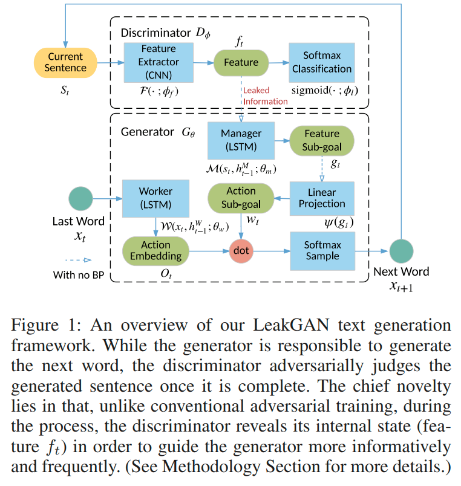

URL: https://www.aaai.org/ocs/index.php/AAAI/AAAI18/paper/download/16360/16061

## Objectiveness
+ The signal given from discriminator lacks intermedia information. => Problem of long text generation

## Points
+ Manager & Worker
+ Discriminator leaks its own high-level extracted feature to the generator

## Main idea

The Worker module takes the last(current) word $x_t$ as its input at each step $t$ and outputs a matrix $O_t$, which is further combined with goal embedding vector $w_t$ by matrix product to determine the distribution of the next word through a softmax.

The Manager module takes the extracted feature $f_t$ as input, which is further combined with the current hidden state $h_{t-1}^M$ of the Manager model to produce the feature sub-goal vector $g_t$. To corporate the feature sub-goal vector $g_t$, a linear transformation $\phi$ with weight matrix $W_{\phi}$ is performed on a summation over recent c goals to produce the action sub-goal vector $w_t$.

At each time step, the last word is input to the Worker network, which  predicts the probabilities of next word. 

## Training Techniques

