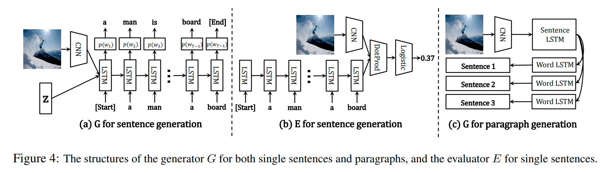

URL: https://arxiv.org/pdf/1703.06029.pdf

## Objectiveness
Improve the naturalness and diversity of text generation using Conditional GAN.

## Points
+ To enforce 2 criterias, extend the loss function to consider three types of descriptions.
+ Update the generator by Policy Gradient
+ Evaluate expected future reward for partially generated sentences using Monte Carlo rollouts

## Model

