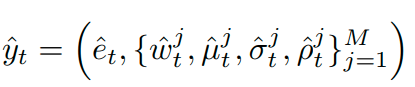
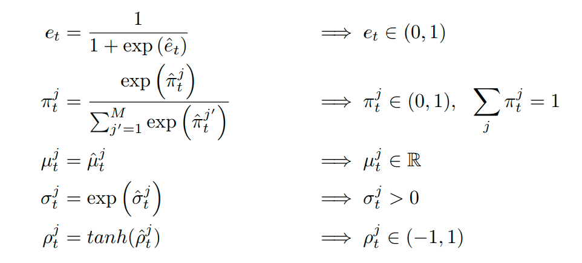
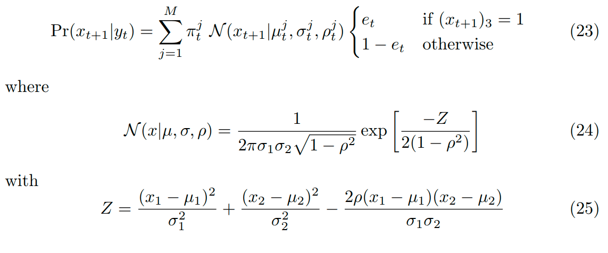
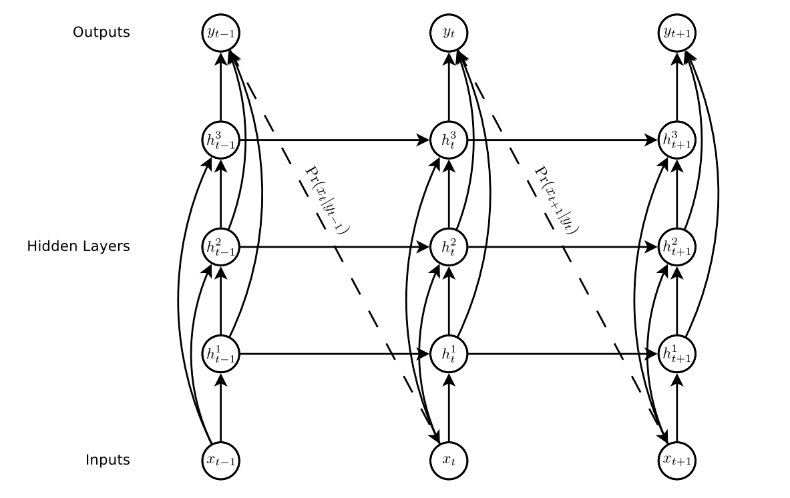

URL: https://arxiv.org/pdf/1308.0850.pdf

Codes: *[TensorFlow](https://github.com/snowkylin/rnn-handwriting-generation)*. *[PyTorch](https://github.com/orris27/rnn-handwriting-generation-pytorch)*

## Objectiveness
Demonstrate that LSTM can be used for complex sequences generation by predicting online handwriting.

## Points
+ The point is defined as (x, y, s), where s represents the state of the point. In other words, if this point is the end of the stroke, then s is equal to 1, otherwise it is equal to 0

+ The LSTM network produces the parameters of mixture distributions, which further generate the next point

+ The outputs of LSTM needs to be preprocessed before they are applied to define the mixtured distribution, since the mixture distribution has certain requirements on its parameters

## Main idea
Build a LSTM structure that takes the list of points as its input and outputs a parameters defining mixture distributions. Apply the mixture distribution to predict the next point.

A mixture Gaussians was used to predict  and , while a Bernoulli distribution was used for .

Note that in the paper, the  and  define the pen offset from the previous point instead of the absolute values.

The outputs, which is denoted with hat to be distinguished from the preprocessed ones, obtains from the LSTM architecture:

The formulas that process the raw outputs to obtain the true parameters that define distributions:

The meaning of the parameters:
+ : parameter of the Bernoulli distribution
+ : weight of the i-th bivariate normal distribution
+  and : means of the i-th bivariate normal distribution
+  and : standard deviations of the i-th bivariate normal distribution
+ : correlation of the i-th bivariate normal distribution

## Objective Function & Loss
### Objective Function

### Loss

## Model

## Experiments Details
+ LSTM: hidden_size=400, num_layers=3, output_size(after another fully-connected layers)=121

+ 20 bivariate normal distribution + 1 Bernoulli distribution

+ RMSProp

+ LSTM derivates are clipped in the range `[-10, 10]`

+ timesteps while sampling: 700

## Dataset
+ IAM
+ SVC
